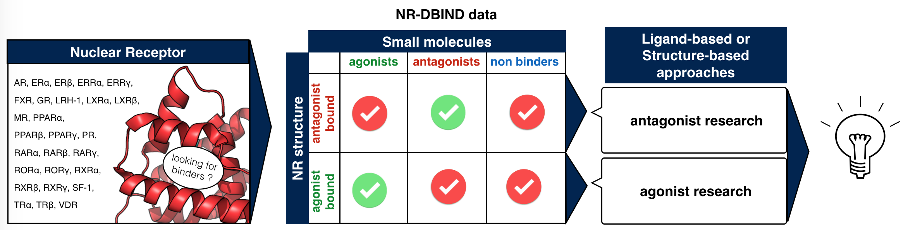

## Development of Deeprank-GNN - Bonvin Lab, CSB group, UU
Deeprank-GNN is a Graph Neural Network framework to learn interaction patterns from protein-protein interfaces 
  * See : <a href="https://github.com/DeepRank/Deeprank-GNN/">Deeprank-GNN Github page</a>
  * See : <a href="https://deeprank-gnn.readthedocs.io/">Deeprank-GNN documentation</a>

## Shape-restrained protein-ligand HADDOCK docking - Bonvin Lab, CSB group, UU
Shape-restrained protein-ligand HADDOCK docking

   * See : P.I. Koukos, M.F. Reau and A.M.J.J. Bonvin. <a href="https://www.biorxiv.org/content/10.1101/2021.06.10.447890v1">Shape-restrained modelling of protein-small molecule complexes with HADDOCK.</a> bioRxiv doi:10.1101/2021.06.10.447890 (2021).

Early versions of this protocol were used to perform drug repurposing on COVID-19 proteins 
   * See : <a href="https://www.bonvinlab.org/covid/">https://www.bonvinlab.org/covid/</a>

## Importance of inactive data in models : application to virtual screening in human health and environnement - example of nuclear receptors - Cnam, GBCM
Study of the evolution of the use of decoy compounds and true inactive data into model evaluation and construction for CADD
   * See : <a href="https://pubs.acs.org/doi/10.1021/acs.jmedchem.8b01105">Réau <em>et al</em>, Front. Pharmacol. 2018</a>

Creation of the NR-DBIND (Nuclear Receptors DataBase Including Negative Data)
   * See : <a href="https://pubs.acs.org/doi/10.1021/acs.jmedchem.8b01105">Réau <em>et al</em>, J. Med. Chem 2019</a>

Identification of computer-aided drug design (CADD) pipelines to identify modulators of different nuclear receptors
   * Docking approach
   * Pharmacophore modeling approach
   * See : <a href="https://www.mdpi.com/2073-4409/8/11/1431">Réau <em>et al</em>, Cells 2019</a>

## Theranalpha Project (Theranostic TNFa inhibitors) - Cnam, GBCM
{: style="text-align: justify"} 
The global objective of this project is to design and evaluate *in vitro* and *in vivo* theranostic small molecule inhibitors of TNFa to further provide inexpensive anti-TNFa therapies administered orally. 

{: style="text-align: justify"} 
Project coordinator : Marc Port, <a href="http://cmgpce.cnam.fr/cm-presentation-de-l-equipe-contacts-et-acces-703730.kjsp">Laboratoire de Chimie Moléculaire</a>, CNAM 
The project is supported by an ANR grant: <a href="http://www.agence-nationale-recherche.fr/Project-ANR-17-CE18-0024">Read the full ANR project</a>

#### Collaborators
   * Laboratoire CM (Chimie Moléculaire), CNAM, Paris
   * Laboratoire GBA (Génomique, Bioinformatique et Applications), CNAM, Paris
   * Laboratoire SATIE (Laboratoire des Systèmes et Applications des Technologies de l'Information et de l'Energie) 
   * PEPTINOV SAS
