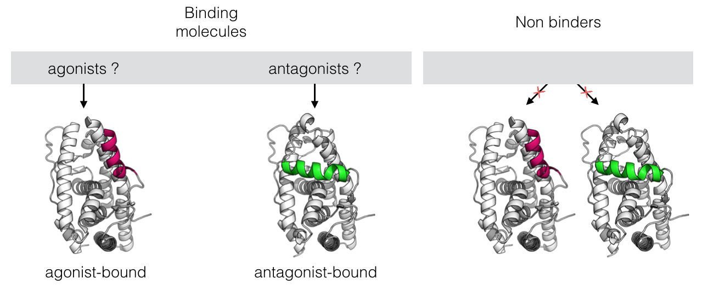

# Integration of Negative Data Into Benchmarking Databases: Application to Nuclear Receptors
### What does negativity stands for ? 
 
Today, we deplore the lack of negative data reported in litterature and public databases. If most screening results are analysed through a "sensitivity" point of view (i.e. how many true positives are selected), the inclusion of true negative confers weight to the "specificity" point of view (i.e. how many true negatives are rejected). This means can not only bring answers to **"what is responsible for the ligand/protein affinity/activity ?"**, but also to **"which features impede the interaction/ impede triggering a specific activity ?"**

The concept of negative data is relative to the studied system and the intended results. For example, we want to find agonists of a given NRs. An evident type of negative data are the molecules that did not show any experimental binding affinity against the NR. 
However, binder can ellicit different kind of activities depending on their pharmacological profile (i.e. agonist, antagonist, partial agonist/antagonist, inverse agonist). In this case, **only** agonists should be considered in true positif set, while molecules displaying non wanted pharmacological profiles can be considered in the negative set. This imply that a sharp annotation step is necessary prior to library screening.

### Why do we study Nuclear Receptors (NRs) ?
The NRs constitute an important family of transcription factors (TFs), with a total of 48 human NRs. NRs regulate gene expression in various physiological processes through their interactions with small hydrophobic molecules. Their implication in various diseases (obesity, diabetes, metabolic syndromes, impaired reproductive system development etc.) make them important class of targets for drugs. Many efforts are put in identifying NRs modulators with reduced side effects.

Additionally, experimental studies show that NRs are also targeted by endocrine disrupting chemicals (EDCs) that mimic and replace the endogenous ligands. Inappropriate exposures to EDCs can impair key physiological functions and lead to dramatic impact on human and wildlife health.

Thanks to the amount of published data concerning NRs, it is possible to build prediction models to assist scientists from various research fields in identifying NRs ligands in drug design campaign, or in understanding EDCs mode of action. Nonetheless, high data quality is required to generate reliable models. 

Gathering quality data with documented annotation and including negative annotation was the first big challenge of my thesis at the GBA, CNAM.

### Creation of the NR-DBIND (Nuclear Receptors DataBase Including Negative Data)
In a previous work, Lagarde et al created the NRLiSt BDB, an NR-focused benchmarking database that aimed to correct and complete annotation errors found in ChEMBL. This database mainly contains activity values (IC50 and EC50) collected through a manual literature
review, including their corresponding "agonist" or "antagonist" pharmacological profile annotation.
We constructed the NR-DBIND to complete information brought by the NRLiSt BDB with more affinity data, more diversity in pharmacological profiles annotation, more experimental details, and particularly to include negative data. 

The database provides 15116 positive and negative interactions data for 28 NRs together with 599 PDB structures and is freely available here.

### Applications
The NR-DBIND can be used as a reliable source of data for researchers from different fields trying to understand and modulate NRs functions. The NR-DBIND datasets are notably suited for in silico studies using structure- and ligand-based methods.
Among our multiple projects, we are exploring the impact of structure choice in the performance of docking tools on datasets fully composed of true positive and true negative ligands.
Ongoing

# Theranalpha Project (Theranostic TNFa inhibitors)
The global objective of this project is to design and evaluate *in vitro* and *in vivo* theranostic small molecule inhibitors of TNFa to further provide inexpensive anti-TNFa therapies administered orally. 

Project coordinator : Marc Port, <a href="http://cmgpce.cnam.fr/cm-presentation-de-l-equipe-contacts-et-acces-703730.kjsp">Laboratoire de Chimie Moléculaire</a>, CNAM 
The project is supported by an ANR grant: <a href="http://www.agence-nationale-recherche.fr/Project-ANR-17-CE18-0024">Read the full ANR project</a>
### Collaborators
- Laboratoire CM (Chimie Moléculaire), CNAM, Paris
- Laboratoire GBA (Génomique, Bioinformatique et Applications), CNAM, Paris
- Laboratoire SATIE (Laboratoire des Systèmes et Applications des Technologies de l'Information et de l'Energie) 
- PEPTINOV SAS
